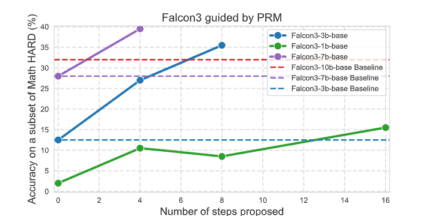

# 🚀 Fine-Tuning and Guided Inference for Mathematical Reasoning

Welcome to this repository! Here, you'll find all the necessary code to:

1. **Generate high-quality data** 📊  
2. **Fine-tune models** to improve their mathematical reasoning or transform them into Process Reward Models (PRMs) 🧠  
3. **Perform step-by-step guided inference** using a PRM to evaluate and guide the reasoning process 🔍  

---

## 📂 Repository Structure

### 1. **`MCTS_Data`**: High-Quality Data Generation  
This folder contains the code to generate high-quality datasets with the following structure:  
- **Column 1**: The question and the beginning of the solution.  
- **Column 2**: The next step in the solution (just one step, not the entire solution).  
- **Column 3**: The evaluation of the step, represented as a score between `0` and `1`, which estimates the likelihood that the step leads to the correct final result.  

---

### 2. **`Process Reward Model FineTuning`**: Fine-Tuning a PRM  
This folder contains the code to fine-tune a Large Language Model (LLM) into a **Process Reward Model (PRM)**.  
- The loss function in the `Trainer` has been modified to use **Binary Cross-Entropy Loss (BCE Loss)**, which better aligns with the objective of assigning a score between `0` and `1` to each step.  
- Below is an example of how a PRM evaluates a step. The step being evaluated is the one following the `<next>` token:  

### 3. **`Reinforcement Learning (PPO)`**: Fine-Tuning for Better Math Skills  
This folder contains the code to fine-tune an LLM using **Proximal Policy Optimization (PPO)** to improve its mathematical reasoning.  

- **Input Format**: The model receives a question and the beginning of a solution as input, and it generates only the **next step** (not the entire solution).  
- **PRM Feedback**: The PRM provides a clear and precise signal on the quality of the proposed step, enabling the LLM to improve quickly and effectively.  
- **Results**: Even though the LLM generates only one step at a time and the PRM evaluates just that step (without knowing the full solution), the model achieves significant improvements in mathematical reasoning -> a relative improvement of 20% in results on the Math Hard benchmark (used for Hugging Face's LLM ranking) while maintaining comparable or even better performance on other benchmarks (particularly those related to reasoning or mathematics, such as GSM8K).  

---

### 4. **`Guided Search`**: Step-by-Step Guided Inference  
This folder contains the code for **guided inference** using a PRM:  

- **Step 1**: The LLM generates multiple possible next steps for a given question (using temperature-based sampling).  
- **Step 2**: The PRM evaluates these steps and selects the best one.  
- **Step 3**: The selected step is added to the prompt, and the process repeats until the final solution is reached.  

**Results**:  
- This guided approach allows smaller LLMs to outperform larger models on challenging benchmarks like **Math Hard** (with the 3B version of Falcon outperforming much larger models like its 7B and even 10B versions!), one of the most difficult mathematical reasoning benchmarks (used in Hugging Face's LLM leaderboard).  

---

### 5. **`Key Highlights`**: Why This Repository Stands Out  
- **High-Quality Data**: Structured datasets for precise evaluation.  
- **PRM Fine-Tuning**: Tailored loss function for step evaluation.  
- **Reinforcement Learning**: Efficient training with step-by-step feedback.  
- **Guided Inference**: Smaller models achieve state-of-the-art results with PRM guidance.  

---

Feel free to explore the code and adapt it to your needs. Contributions are welcome! 😊  

---

## 📧 Contact  
If you have any questions or suggestions, feel free to open an issue or reach out. Happy coding! 💻
